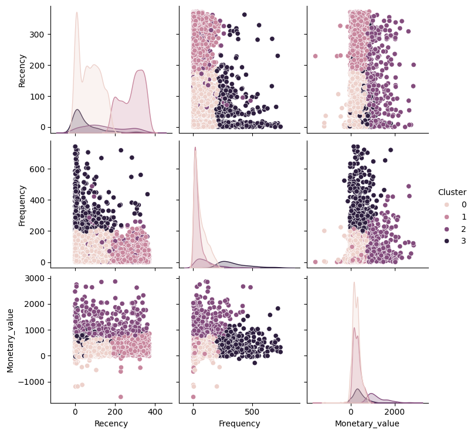

# Customer Segmentation using RFM and K-Means Clustering

##  Problem Statement:
Understanding customer behavior is crucial for businesses. By segmenting customers based on their purchasing patterns, businesses can:
- Identify **high-value** customers.
- Recognize **at-risk** customers.
- Personalize marketing strategies for **customer retention** and **acquisition**.

## Dataset:
The dataset consists of transaction records from an e-commerce platform with the following key attributes:
- `InvoiceNo` – Unique invoice identifier.
- `StockCode` – Product identifier.
- `Description` – Product description.
- `Quantity` – Number of units purchased.
- `InvoiceDate` – Date of purchase.
- `UnitPrice` – Price per unit.
- `CustomerID` – Unique customer identifier.
- `Country` – Country of purchase.

## Methodology:
### 1. Data Preprocessing
- Handled missing values and duplicates.
- Converted `InvoiceDate` to a datetime format.
- Removed outliers using **Z-score analysis**.

### 2. RFM Analysis
- **Recency (R)**: Days since the customer’s last purchase.
- **Frequency (F)**: Number of transactions by each customer.
- **Monetary Value (M)**: Total spend per customer.

### 3. K-Means Clustering
- Determined the optimal number of clusters using the **Elbow Method** and **Silhouette Score**.
- Segmented customers into **4 clusters**.

### 4. Insights from Clusters
- **Cluster 3:** Loyal and high-spending customers.
- **Cluster 2:** Less engaged customers with high recency.
- **Cluster 1 & 0:** Intermediate customers who can be nurtured.

## Results & Visualizations
- **Pair plots** to analyze feature distributions across clusters.
- **Box plots** to compare `Recency`, `Frequency`, and `Monetary Value` across clusters.
- **Bar charts** showing average RFM values per cluster.

## Technologies Used
- **Python**
- **Pandas, NumPy** – Data Manipulation
- **Matplotlib, Seaborn** – Data Visualization
- **Scikit-Learn** – Machine Learning (K-Means Clustering)
- **StandardScaler** – Feature Scaling

## Future Enhancements
- To implement **Hierarchical Clustering** for better interpretability.
- Developing **automated customer insights** with dashboards.
- Integrating with **real-time e-commerce data**.
